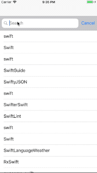

<h1 align="center">ios-architecture</h1>

👷 🧱 🧰 🛠️

<strong>Demystifying MVC, MVVM, VIPER, RIBs and many others</strong>

 A collection of simple one screen apps to showcase and discuss different architectural approaches in iOS

 

<!-- Last commit -->

<!-- Open issues -->

<!-- Swift version -->

<!-- Platform -->

<!-- License -->

Built with ❤︎ by
Pawel Krawiec

 
 

## Apps

| Multi-screen examples | Single screen examples |
| ------------- | ------------- |
|  | |

## Architectures
This repository hosts each sample app in separate directory.

:star: Click the title of example to see detailed README information about specific architecture.

### Multiple screens app examples
🔒 ** If you want to login, use username `iostest` and password `test`.**

*If you're a [themoviedb](themoviedb.com) user, please use your own account and API key!*

| Example | Description |
| ------------- | ------------- |
| [tmdb-mvvm-rxswift-pure](tmdb-mvvm-rxswift-pure) | Uses [RxSwift](https://github.com/ReactiveX/RxSwift) and observables as binding mechanism between `ViewController` and `ViewModel`. Also, it uses simple navigator pattern for transitions between screens. |

### Single screen app examples
The purpose of having examples with single page applications is highlighting connection between view code and business logic code.

| Example | Description |
| ------------- | ------------- |
| [mvc](mvc) | Standard MVC pattern recommended by Apple. Uses composition design pattern to make `ViewController`  smaller. |
| [mvvm-rxswift-pure](mvvm-rxswift-pure) | Uses [RxSwift](https://github.com/ReactiveX/RxSwift) and observables as binding mechanism between `ViewController` and `ViewModel`. |
| [mvvm-rxswift-functions-subjects-observables](mvvm-functions-subjects-observables) | Uses [RxSwift](https://github.com/ReactiveX/RxSwift) and observables as outputs from `ViewModel`. `ViewModel` inputs are defined as subjects wrapped in functions. |
| [mvvm-rxswift-subjects-observables](mvvm-rxswift-subjects-observables) | Uses [RxSwift](https://github.com/ReactiveX/RxSwift) with observables as `ViewModel` outputs and subjects as `ViewModel` inputs. |
| [mvvm-delegates](mvvm-delegates) | Binds `ViewController` and `ViewModel` using delegation pattern.   |

### Examples in progress
| Example | Description |
| ------------- | ------------- |
| mvp| In Progress |
| mvvm+rxfeedback | In Progress |
| mvvm-closures | In Progress  |
| mvvm-reactive-swift | In Progress  |
| reswift | In Progress  |
| viper | In Progress  |
| viper-rxswift | In Progress  |
| ribs | In Progress  |

## Sample apps
Apps in this repository are split into 2 groups - single screen and multiscreen.

Simple one screen apps aim to be simple enough that you can understand crucial bits about given architecture (i.e. bindings between `ViewModel` and `ViewController` in MVVM examples).
However, some other architectures require more complexity (i.e. RIBs architecture) and this is the reason of having multiscreen examples in this project.

#### Single screen app
Single screen app is a simple list of repositories fetched from GitHub and a text field that makes queries for new data.

#### Multiscreen app
Multiscreen app is a simple [themoviedb](themoviedb.com) client.
It lets user to authenticate, view popular movies/tv shows or actors and see details about each movie. Also, it has a search screen that allows you to browse movies or actors.

## Open in Xcode
Clone the repository:

`git clone git@github.com:tailec/ios-architecture.git`

Go to example directory, for example:

`cd mvvm-pure-swift`

Install pods:

`pod install`

**Note:** Some of the examples don't use external libraries so `pod install` is not required.

## Licence
MIT.
